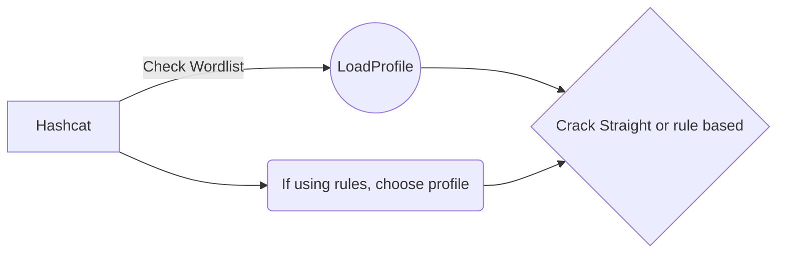

# Hashcat Cracking Manager!

Many times we struggle with looping through wordlists and rules finding a more efficient strategy of cracking passwords. This helps ease that problem by making some minor calculations and loading efficient cracking rules.

# Files

 - hashcat_runner.sh - Meant for linux boxes
 - hashcat_runner.ps1 - Windows Equivalent

## File Location

The windows version requires to run from the same folder as the binary hashcat.exe however on linux it can invoke globally from any folder

## Editing

In both versions there are house keeping variables that are dependent on your environment. 

